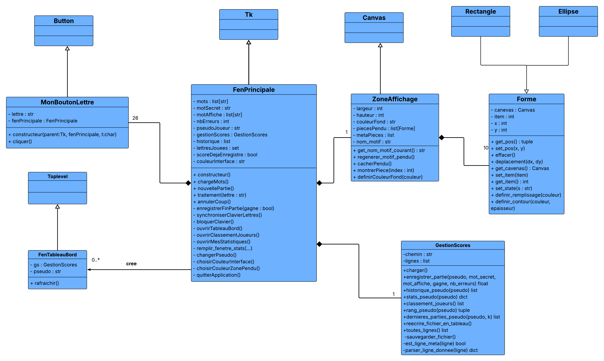
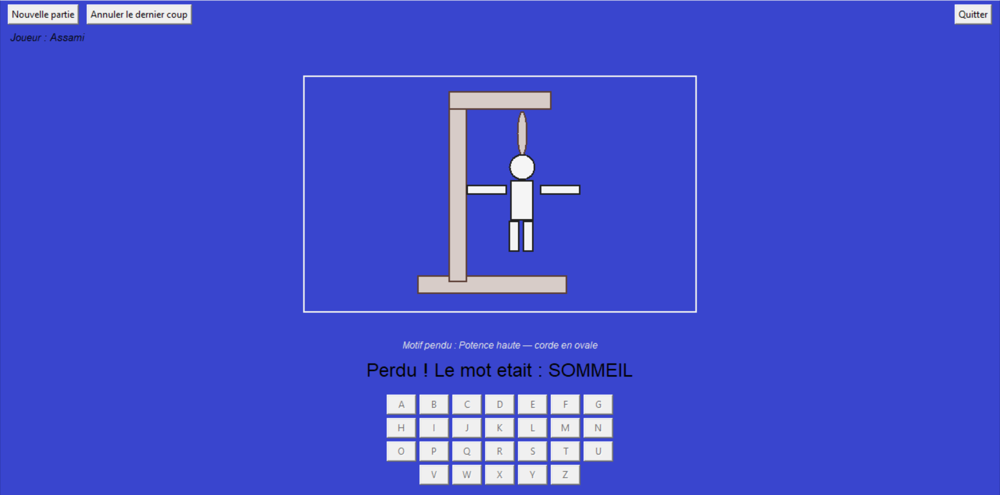
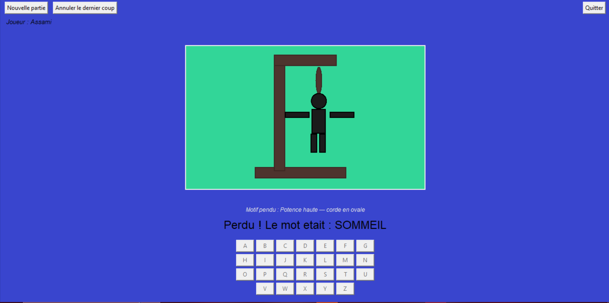
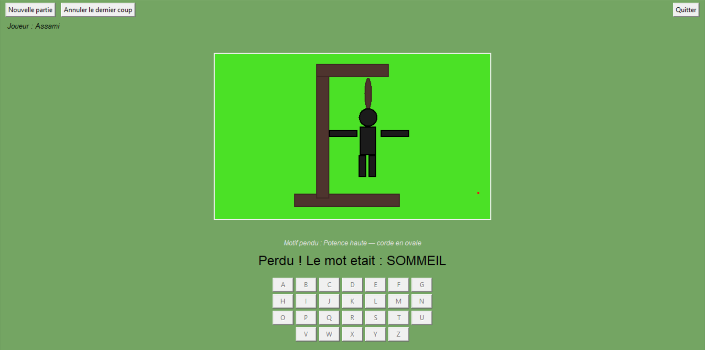
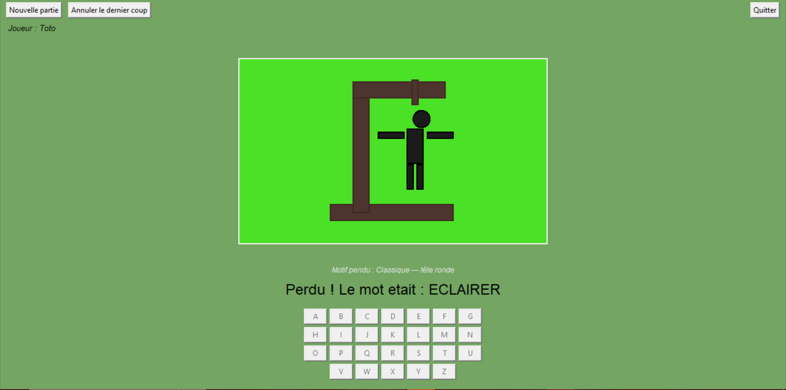
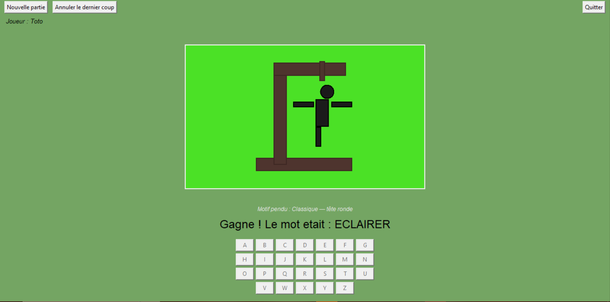
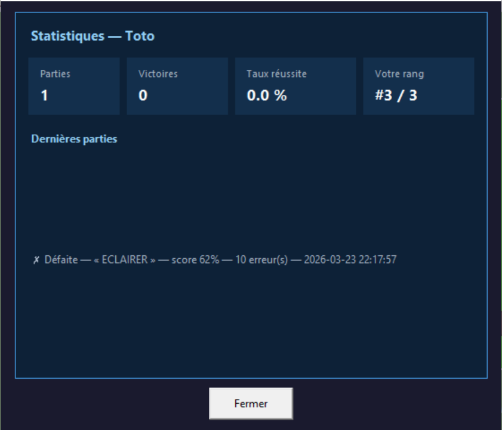
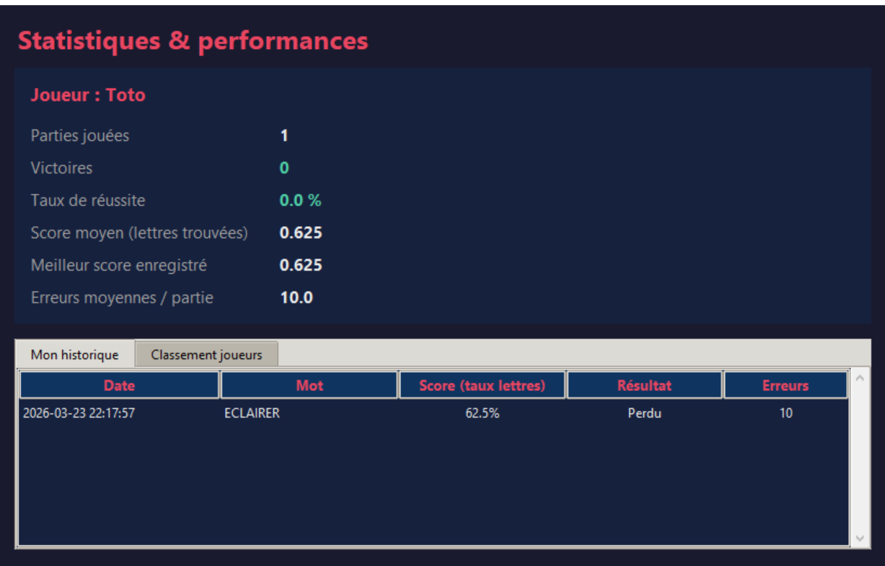
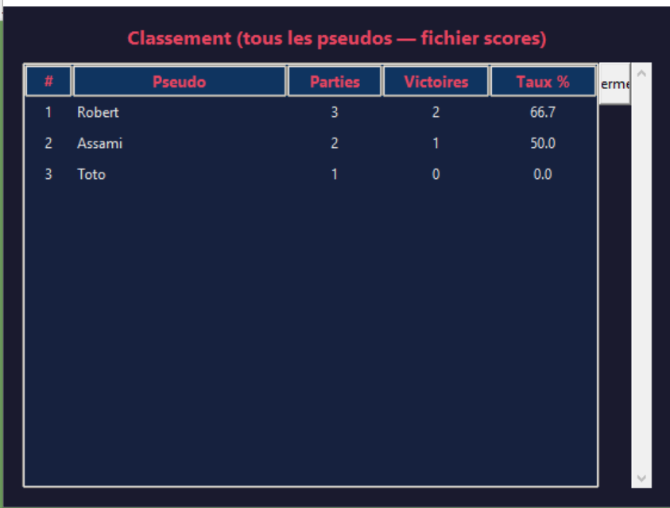
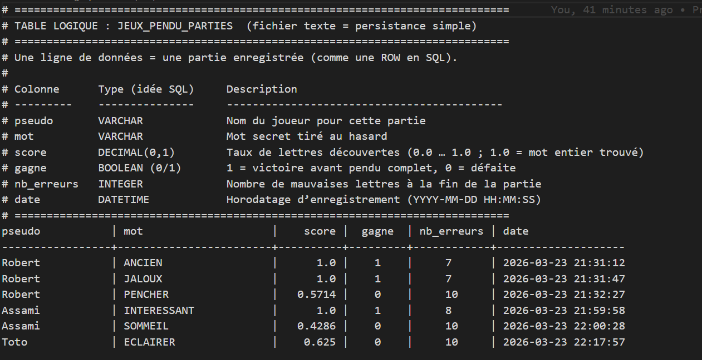

# Compte-rendu de projet  
## TD5 — Jeu du pendu (Partie 4 : améliorations et bonus)

### En-tête

| Élément | Détail |
|:--------|:-------|
| **Auteurs** | **Robert Valere DJAHLIN-NICOUE** **Assami TRAORE** |
| **Encadrante** | **Mme Lamia DERRODE** |
| **Cours** | INF-TC2 — Programmation orientée objet |
| **Nature du rendu** | Devoir 2 — archive conforme aux consignes Pedagogie1 |
| **Groupe** | B2b |
| **Date de rendu** | 23/03/2026 |

---

## Résumé

Le présent document rend compte des **améliorations apportées au jeu du pendu** dans le cadre de la quatrième partie du TD5. Il complète le livrable technique (`Pendu.py`, `mots.txt`, `formes.py`) par une **vue d’ensemble de la modélisation** et une **mise en valeur des fonctionnalités ajoutées**, du point de vue de l’utilisateur et de l’architecture logicielle. Les captures d’écran et le diagramme UML sont regroupés dans le dossier **`figures/`** et référencés ci-dessous.

---

## 1. Contexte et périmètre du compte-rendu

Le travail réalisé en binôme prolonge une application de pendu développée en séances encadrées. La **partie 4** du TD impose trois niveaux d’exigence : personnalisation de l’apparence, mécanisme d’annulation des coups, puis **bonus** consacré au suivi des parties et des joueurs. Nous avons **dépassé le socle minimal** sur ce dernier point en proposant un dispositif de **consultation des statistiques** et de **classement**, tout en conservant une interface de jeu claire et centrée sur la partie en cours.

Ce rapport se concentre, comme demandé dans les consignes, sur **cette partie finale du projet** ; le diagramme de classes UML **complet** y est toutefois inclus pour situer ces évolutions dans l’architecture globale.

---

## 2. Modélisation logicielle (diagramme de classes)

### 2.1 Figure A — Diagramme UML complet

### 2.2 Lecture de la modélisation

L’architecture repose sur une **fenêtre principale** qui concentre la logique de partie et l’assemblage de l’interface. La **zone d’affichage** du pendu est isolée dans une classe dédiée, ce qui sépare clairement le **contrôle du jeu** et la **représentation graphique**. Les formes géométriques du dessin suivent une hiérarchie commune, ce qui facilite leur gestion uniforme (visibilité, style).

Les améliorations de la partie 4 se traduisent notamment par l’introduction d’un **service de persistance et d’analyse des scores**, modélisé par une classe dédiée, et par une **fenêtre secondaire** dédiée au tableau de bord. La relation entre la fenêtre principale et ces éléments est explicite sur le schéma (composition, dépendances, multiplicités), ce qui reflète la **responsabilité** de chaque composant sans entrer dans le détail d’implémentation.

Le joueur n’est pas matérialisé par une classe autonome : l’identité est portée par un **identifiant textuel** (pseudo), cohérent avec un stockage tabulaire des parties jouées. Ce choix allège le modèle tout en restant adapté au périmètre du projet.

---

## 3. Présentation des améliorations fonctionnelles

### 3.1 Personnalisation de l’expérience visuelle 

**Objectif :** offrir à l’utilisateur un **contrôle sur l’ambiance** de l’application sans encombrer l’écran de jeu.

**Apport réel :** deux niveaux de personnalisation sont proposés via le menu *Apparence* : la **teinte générale** de l’interface (barres, fonds, zone de texte) et la **couleur du canevas** où s’affiche le pendu. Lorsque la zone de dessin change, les couleurs du personnage et de la potence sont **rééquilibrées** pour conserver une lisibilité satisfaisante sur fond clair comme sur fond sombre. Cette attention portée au **contraste** participe à la qualité perçue du produit.

**Figure B — Personnalisation des couleurs**

 

 

---

### 3.2 Annulation des coups 

**Apport réel :** l’utilisateur peut revenir en arrière sur le **dernier coup joué**, et répéter l’opération pour remonter plusieurs étapes tant que la partie n’est pas terminée. Le mot masqué, l’état du pendu et l’état du **clavier virtuel** restent **mutuellement cohérents** après chaque annulation, ce qui évite toute ambiguïté pour le joueur. Cette fonctionnalité améliore le confort d’utilisation (correction d’un clic involontaire, exploration pédagogique) tout en respectant la logique du jeu.

**Figure C — Fonction d’annulation**

 

---

### 3.3 Suivi des joueurs et des performances (Bonus)

**Objectif :** relier le jeu à une **mémoire persistante** et à des indicateurs de réussite conformes à l’énoncé (score basé sur la **proportion de lettres découvertes**).

**Apport réel :** chaque nouvelle partie est associée à un **pseudo** ; en fin de manche, le résultat est **enregistré de manière fiable** (une seule écriture par partie terminée). Les données sont conservées dans un **fichier texte structuré** : en-têtes explicites et présentation en colonnes, pensée comme l’équivalent lisible d’une **table relationnelle**, ce qui facilite la lecture humaine et prépare une éventuelle évolution vers une base de données.

Au-delà du stockage brut, l’application propose :

- une **vue statistique personnelle** (menu dédié) ;
- un **tableau de bord** regroupant historique détaillé et **classement** entre joueurs ;
- un accès rapide au **classement global** depuis le menu.

L’ensemble positionne le pendu non seulement comme un jeu, mais comme une **petite application de suivi d’activité**, sans alourdir l’écran principal pendant la partie.

**Figure D — Suivi et statistiques**

 

 

 

**Figure E — Exemple de fichier de données structuré**

---

## 4. Synthèse de la valeur ajoutée

Le tableau ci-dessous regroupe, de façon synthétique, **l’ensemble des apports** de la partie 4 et du bonus : référence à l’énoncé, valeur pour l’utilisateur final, et valeur pour la **qualité du produit logiciel** (architecture, traçabilité).

**Tableau 1 — Synthèse de la valeur ajoutée**

| N° | Thématique | Référence (TD5 — partie 4) | Valeur pour l’utilisateur | Valeur pour le projet (architecture & pérennité) |
|:--:|:-----------|:---------------------------|:--------------------------|:------------------------------------------------|
| 1 | **Personnalisation visuelle** | Exercice 7 — Apparence | Contrôle de l’ambiance couleur ; interface lisible grâce au contraste automatique sur le pendu | Séparation claire *menus* / *aire de jeu* ; pas de surcharge de boutons sur l’écran principal |
| 2 | **Annulation des coups** | Exercice 8 — Undo (« Triche ») | Possibilité de corriger une erreur ou d’explorer le jeu sans pénaliser définitivement un clic | Cohérence du **modèle de partie** avec l’affichage (mot, pendu, clavier) après chaque retour arrière |
| 3 | **Scores & persistance** | Bonus — Score joueur | Parties enregistrées sous pseudo ; score reflétant la **proportion de lettres trouvées** | **Mémoire durable** (fichier structuré) ; documenté comme équivalent conceptuel d’une table relationnelle |
| 4 | **Statistiques & classement** | Bonus — historique / performances (extension) | Vue sur l’historique personnel, le classement global et un tableau de bord dédié | **Modularité** : fenêtres et menus dédiés sans alourdir l’écran de jeu ; évolutivité vers une base de données |
| 5 | **Modélisation** | CR — diagramme UML complet | — (document de conception) | Lisibilité des **responsabilités** et des liens entre classes ; justification des choix d’agrégation et de dépendance |

---

## 5. Conclusion

Les travaux décrits répondent aux **exigences obligatoires** de la partie 4 et au **bonus** prévu à l’énoncé, avec des extensions **pertinentes** pour l’usage (tableaux de bord, classement, fichier documenté). La modélisation objet associée permet de **situer chaque responsabilité** et de justifier les choix d’assemblage entre composants graphiques, logique de jeu et couche « données ».

---

